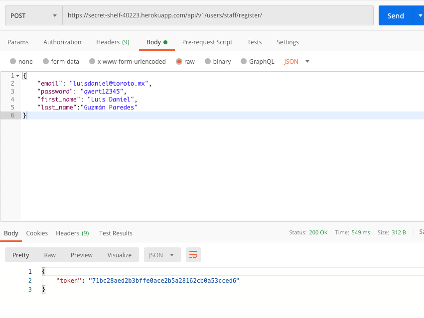
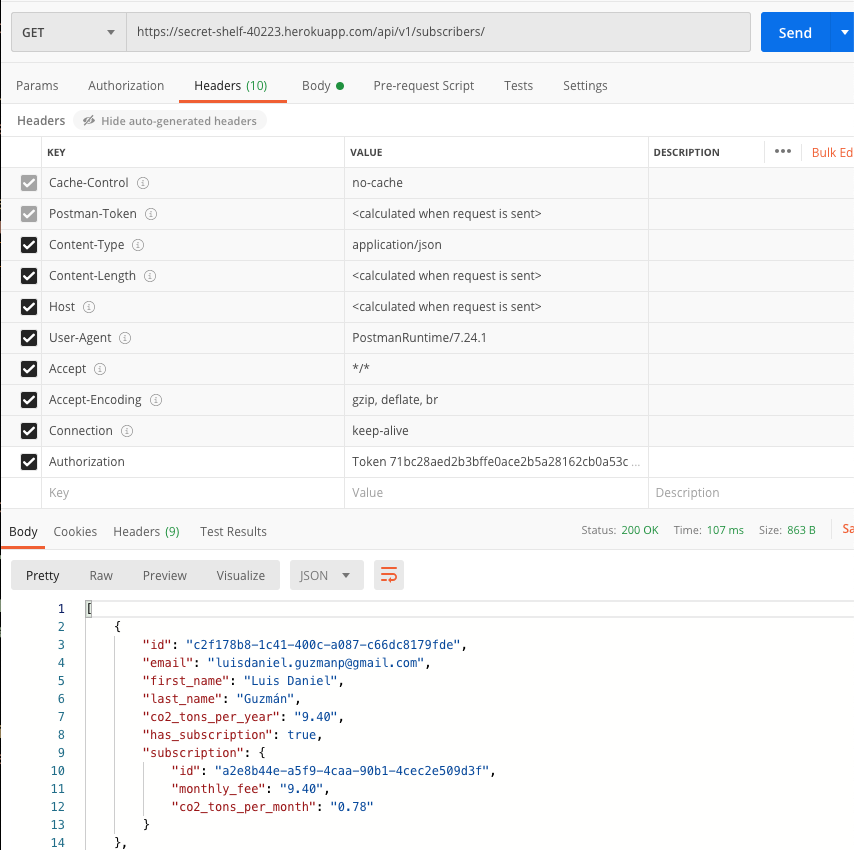

# toroto-challenge Docker Compose

|Service| Service Name | Port |
|---|---|---|
| postgres | toroto_postgres | 5432 |
| backend | toroto-challenge_backend | 8000 |
| frontend | toroto-challenge_frontend | 3000 |

## Setting everything up

1. Install docker https://www.docker.com/get-docker
3. Install docker-compose https://docs.docker.com/compose/install/
4. cd into root directory
5. Build and start all services `docker-compose up --build`
6. Apply all initial migrations `docker-compose run backend python manage.py migrate`
7. Go to http://localhost:3000/

## Basic Usage

- Build all services `docker-compose build`

- Start all services `docker-compose up`

- Stop all services `docker-compose stop`

- Open the shell `docker-compose exec backend /bin/sh`

## API Usage Example

1. Register as an user:
    - url: https://secret-shelf-40223.herokuapp.com/api/v1/users/staff/register/
    - method: POST
    - body: (Select raw and JSON options)
    ```json
    {
        "email": "your email",
        "password": "your password",
        "first_name": "your first name",
        "last_name": "your last name"
    }
    ```
    
2. Copy the auth token from the response
3. Create a new request for subscribers list:
    - header: 
        - `Key = Authorization` 
        - `value = Token {paste_token}`
    - url: https://secret-shelf-40223.herokuapp.com/api/v1/subscribers/
    - method: GET
    
    
